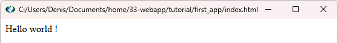

# WebApp

*A tool to create standalone applications based on web technology.*  

*Could be compared to Node.js with Electron, without the Software bloat.*

## 1. Tutorial

The goal of the webapp tool is to allow creating applications with web technology in the simplest possible way, assuming you already have some basic knowledge of creating web pages based on HTML, CSS and Javascript. It provide a set of local Operating System API with a very low overhead (less than 1 MB). Works seamlessly, on both Windows and Linux Operating Systems.
Here you will learn the general philosophy of the tool by creating simples applications.

### How to write an app in 2 steps

#### First step/First app: Hello World!

Our first application will be the everlasting "Hello World!" app.
 To achieve that just create a folder, let’s call it "my_app".
 Then within this folder, create a file named "index.html" containing the sentence "Hello world!" and drop the webapp binary into that folder, run it and your application appears:

<p align="center"><br/>View of your First app</p>

To insure your app to run on both Windows and Linux you may even drop the 2 systems binaries, they each have a weight of less than a MByte.

If you want this application to have a persistent size and position between each call, just add a file called ".config.ini" in its folder.

#### Second step/second app

Now for a somewhat more complex app, modify the file "index.html" to have the following content:

```html
<!DOCTYPE html>
<html>
<head>
    <meta charset="UTF-8">
    <meta http-equiv="Content-Type" content="text/plain; charset=utf-8">
    <title>🤖My second app💥</title>
    <script>
        const msg = "My wonderful app (c) <Your name>";
        console.log("Starting");
        if (app && typeof app !== "undefined" && typeof app.set_title === "function") {
            console.log("Starting as a webapp");
            app.show();
            app.set_title(document.title);
            app.set_icon("app.ico");
            //app.set_size(300,200);
            function clicked() {
                gui.msgbox("&#128570;" + msg + '\nBased on ' + app.info)
            }
        } else {
            console.log("Starting as a web page");
            function clicked() {
                alert("😺" + msg);
            }
        }
    </script>
</head>
<body>
    Hello world !
    <br />
    <button onclick="clicked()">Click me !</button>
</body>
</html>
```

You may add an icon to your application, *see the call to "app.set_icon(app.ico)" in the "script" block of the index.html file.*

Now when running the webapp binary the following windows appears:

<p align="center"><br/>Second app</p>

And if you click the "Click me!" button, the following dialog appears:

<p align="center"><br/>Native msgbox with your app</p>

Also notice that the way this app is created, allows it to correctly run under a web browser. See the below examples:

<p align="center"><br/>Second app under Chrome</p>
<p align="center"><br/>Second app under Firefox</p>

But this may not always be the case, especially when using the webapp "local objects" methods and properties which have no counterpart in a web browser environment.

#### Options and API

The webapp options and objects are documented by invoking the binary alone (without any index.html on its side or without any options), here follows the output:

```console
webapp version 0.6.0-Theo  
(C) D. LALANNE - MIT License.  
Usage: webapp [OPTIONS] ARGUMENTS  
Available options  
 -p, --prompt            Change the interpreted mode prompt (default is '>').  
 -v, --version           Output version information (And exit if not in interpreted mode).  
 -h, --help              Display this message (And exit if not in interpreted mode).  
 -b, --browser-args ARG  Provide additional browser arguments to the webview2 component.  
 -c, --html ARG          Provide an html string that will be directly set to the webview.  
 -f, --url ARG           Provide a url, a remote one must prepended with 'http://', a local one must have one of the following extensions .html, .htm, .webapp or .wa.  
 -w, --work-dir ARG      Provide the path where could be found a file with a name within the following ones: webview.min.html, webview.html, index.min.html, index.html, index.min.js, index.js.  
    The use of these 3 previous options is mutually exclusive.  
    It is also possible to directly provide their argument as the last one of the command (hence witout the option), but prepended with "html://", for -c.  
 -t, --title ARG         Set the title of the webview windows, default is to display the url as title if it is provided or nothing if just an html string is provided.  
 -j, --js ARG            Inject a javascript command before loading html page.  
 -r, --runjs ARG         Run the provided javascript command and exits.  
 -d, --debug             Activate the developper mode in the webview.  
 -l, --log-level ARG     Set the log level. Their precedence is: ALL < TRACE < DEBUG < INFO < WARN < ERROR < FATAL < OFF.  
 -g, --log-file ARG      Set the log file name.  
 -q, --quiet             Alias for -l OFF.  
    These three previous option may also be set by the environment variables 'LOG' and 'LOGFILE' but the options have precedence on the environment.  
    If neither the environment nor the options are set then relies on the debug option if it is used to set the log level to 'DEBUG'.  
 -u, --help-js           List and briefly explain all the javascript objects extending the webview.  
 -n, --icon ARG          Set windows icon with the provided .ico file.  
 -G, --geometry ARG      Attempt to modify geometry when starting the webapp with the one to four parameter passed, separated by commas (x, y, width, height).  
 -m, --minimized         The webview window will be minimized at startup.  
 -M, --maximized         The webview window will be maximized at startup.  
 -s, --hidden            The webview window will not be shown at startup.  
 -k, --hints ARG         Set webview hints => 0: width and height are default size, 1 set them as minimum bound, 2 set them as maximum bound. 3 they are fixed. Any other value is ignored.  
A simple arguments will act as -p option.

<u>List of the variables and functions for the objects extending the webview</u>  
*<u>Variables:</u>
Read-only ones are prepended by a '-'*
-app.window_id: window id.
-app.sysname: provide the name of the system, this may help to assert in your javascript code that you are running a webapp, something like <u>console.log(typeof app.system === 'undefined'?'not a webapp':'is a webapp')</u>.
-app.title: title of the webapp window, usually displayed one its title bar.
-app.icon: file name of the icon used by the webapp.
-app.info: informations about the webapp.
-app.args_line: A comma separated string containing the args passed to the webapp
-app.x: horizontal position of the upper left corner of the webapp window.
-app.y: vertical position of the upper left corner of the webapp window.
-app.w: horizontal position of the lower left corner of the webapp window.
-app.h: vertical position of the upper left corner of the webapp window.  
All these coordinate variables are updated in real time. To assert it, try something like:  
<u>(async()=>{ elt=document.createElement('i'); document.body.appendChild(elt); new Promise(function (resolve, reject) { (function _(){ coords=`(${app.x}, ${app.y}, ${app.w}, ${app.h})`; if (elt.innerText != coords) { elt.innerText=coords; } timeoutId=setTimeout(_, 10); })(); }) })()</u>  
And to stop it, later:  
<u>clearTimeout(timeoutId); elt.remove()</u>
-app.left_border: left size of the horizontal border.
-app.top_border: top size of the vertical border.
-app.right_border: right size of the horizontal border.
-app.bottom_border: bottom size of the vertical border.
-app.state: contains the state of the application windows, may have one of the following values: normal, maximised, minimised, hidden, full_screen
-app.last_error: may contains the last app object error
-env.path: actual value of the PATH environment variable
-fs.last_error: may contains the last fs object error
-fs.cwd: current working directory
*<u>Functions:</u>
Asynchronous ones are prepended by a '*'*
 app.help:accepts up to 1 parameter, return this help message and the list of all the available variables and functions for the objects extending the app.
 app.echo:accepts up to 10 parameters, echo the parameter(s) and display on stdout
 app.bring_to_top:accepts up to 1 parameter, Bring the window whose id is provided (or by default the app window) to the top of the z order.
 app.restore:restore the webapp window.
 app.minimize:minimize the webapp window.
 app.maximize:maximize the webapp window.
 app.enter_fullscreen:set the webapp window in fullscreen mode.
 app.exit_fullscreen:exit the webapp window from fullscreen mode.
 app.show:show the webapp window.
 app.hide:hide the webapp window.
 app.set_title:accepts up to 1 parameter, return the actual app title and change it if a new one is provided as a parameter.
 app.set_pos:accepts up to 2 parameters, return the actual app position as a json object (x, y) and if there are parameters then change it.
 app.center:center the window on the screen, the x and y position and width and height will never be out of the screen.
 app.set_size:needs 3 parameters, change the app size with the first 2 provided parameters, a third optional parameter may be added to indicate if you want to define one of the following:  0 change the the app window size (this is the default feature).  1 fix a minimum size bounds.  2 fix a maximum size bounds.  3 set a fixed size. 4 change the app size without taking into account its window borders (default feature is to take it). Return the effectively applied size as a json array [ w, h ]
 app.border_size:return the border size as a json array [ left, top, right, bottom ].
 app.set_geometry:accepts up to 4 parameters, return the actual app position and size as a json object (x, y, w, h) and if there are parameters then change it.
 app.set_icon:accepts up to 1 parameter, set window top left icon and return the previous one if thre was.
 app.on_geometry:accepts up to 1 parameter, set callback to detect when webapp has moved.
 app.on_close:needs 1 parameter, Bypass the window close button functionnality with the provided javascript commands, it is up to the programmer to decide to call the exit function afterwards.
 app.exit:exit from webapp.
*app.system:needs 1 parameter, run an external command in a thread and return its output.
*app.pipe:needs 1 parameter, run an external command in a pipe and return its output.
*app.wpipe:needs 1 parameter, run an external command in a wstring pipe and return its URI encoded output.
*app.shell:needs 1 parameter, open an external windows command in a thread (See ShellExecute) and return its output.
*env.get:needs 1 parameter, return the value of an environment variable.
 env.set:needs 2 parameters, set an environment variable to a given value and return the previous one if it existed.
 env.ins:needs 2 parameters, insert a value into an environment variable and return the previous one if it existed.
 env.add:needs 2 parameters, add a value to an environment variable and return the previous one if it existed.
 env.del:needs 1 parameter, delete an environment variable and return its last value if it existed.
*env.get_path:return the value of the PATH environment variable.
 env.add_path:needs 1 parameter, add a program path to the PATH env variable if is not yet added.
 env.ins_path:needs 1 parameter, insert a program path to the PATH env variable if is not yet added.
 env.set_path:needs 1 parameter, replace the whole value of the PATH environment variable with the provided one.
 env.del_path:delete the value of the PATH environment variable.
*fs.exists:needs 1 parameter, return true if file exists else false and set 'fs.last_error' variable.
 fs.current_path:accepts up to 1 parameter, change the current path to the one provided, if any, and return it, if ok, else return false and set the variable 'fs.last_error'.
*fs.absolute:needs 1 parameter, return the corresponding absolute path of a the parameter or false if error.
*fs.mkdir:needs 1 parameter, create a directory with the provided path if it does not already exists and return true if ok else false and set the variable 'fs.last_error'.
 fs.stat:accepts up to 2 parameters, gives information details on the provided path in json format if second parameter is true (else in text).
*fs.ls:accepts up to 4 parameters, list path (default is current directory), in a simple (default) or detailled list if second parameter is true, in one of the following format: text(default), html or json as defined by the third parameter andrecursively if fourth parameter is true (default is not).
*fs.copy:needs 2 parameters, copy a file or directory (recursively) from 'path1' to 'path2'. Already existing files are updated if necessary. Return true if ok else false and set the variable 'fs.last_error'.
*fs.rename:needs 2 parameters, Moves or renames the filesystem object identified by the first parameter to the one provided by the second parameter as if by the POSIX rename. Return true if ok else false and set the variable 'fs.last_error'.
*fs.remove:needs 1 parameter, remove a file or an empty directory, return true if ok else false and set the variable 'fs.last_error'.
*fs.remove_all:needs 1 parameter, remove a file or a directory RECURSIVELY (BEWARE this erase everything underneath the directory !!)
*fs.read:needs 1 parameter, read a file with the provided file name and return its content, if possible.
*fs.read_to_base64:needs 1 parameter, read a binary file with the provided file name and return its content in base64 encoded text, if possible.
*fs.write:at least 1 parameter, truncate and write to the file who's name is provided as the first parameter, the content of all the following parameters, return true if the operation was OK, else false.
*fs.append:at least 1 parameter, append to the file who's name is provided as the first parameter, the content of all the following parameters, return true if the operation was OK, else false.
*io.write:needs 1 parameter, write a string to stdout.
*io.writeln:accepts up to 1 parameter, write a string and a carriage return to stdout.
*io.ewrite:needs 1 parameter, write a string to stderr.
*io.ewriteln:accepts up to 1 parameter, write a string and a carriage return to stderr.
*io.read:read a string from stdin and return it.
*io.readln:read a line ending with carriage return, from stdin and return it.
*io.has_console:return true if has console else false.
 gui.msgbox:accepts up to 2 parameters, display a message dialog in a 'close to Windows MessageBox style', First parameter is the message and second one indicate whether we need only an 'OK' button (0), or an 'OK' and a 'Cancel' button (1) or a 'Yes' and a 'No' button (2).
 gui.opendlg:accepts up to 3 parameters, display a Windows file selection dialog with the eventually provided filter, initial directory and title. The filter consist in pairs of strings with the first of each providing the name and the second providing the pattern, eventual multiple pattern are separated by a comma (,) and eventual multiple pairs are separated by a pipe (|). If needed ',' & '|' might be neutralized by '\' (a doubled one in javascript).
 gui.savedlg:accepts up to 3 parameters, display a Windows file selection dialog with the eventually provided filter, initial directory and title. The filter consist in pairs of strings with the first of each providing the name and the second providing the pattern, eventual multiple pattern are separated by a comma (,) and eventual multiple pairs are separated by a pipe (|). If needed ',' & '|' might be neutralized by '\' (a doubled one in javascript).
 gui.folderdlg:accepts up to 3 parameters, display a Windows folder selection dialog with the eventually provided initial directory and title (Windows does not allow filter with folder selection).
 win.dark_bar:accepts up to 1 parameter, Set (true) on unset (false) the dark mode for the window bar. It is the responsability of web application to manage a dark mode for the DOM.
 win.printdlg:Open a print or preprint dialog (in this case parameter to true or 'preprint'.)
*win.regsto:accepts up to 3 parameters, store a string to the Windows registry.
*win.regget:accepts up to 3 parameters, retrieve a string from the Windows registry.
 win.monitors_info:Return all monitors information in JSON format.
 win.devices_info:Return all devices information in JSON format.
 win.wallpapers_info:Return all wallpapers information in JSON format.
 win.next_wallpaper:Try to advance to the next wallpaper in the slideshow, and return true if ok, else false.
```

## 2. Going deeper

Now that you understand the general philosophy of the tool, you may have a look at the different examples located in the "examples" directory that comes with the sources package or the git repository.
The binary packages (for both Windows and Linux) are available [there](https://github.com/2nil-web/webapp/releases).

1. Prerequisites to build the app are:  
   
   - git to download the webview library.  
   - make and g++ to build the webview lib and the app under linux, Windows (MSys2) and eventually MacOS (this last one not tested yet).  
   - Or Visual Studio under Windows.  
   - WebView2 under Windows  (default part of the system with Windows 11).
   - gtk+-3.0 webkit2gtk-4.1 webkit2gtk-web-extension-4.1 gtkmm-3.0 under Debian.  
   - gtk4 webkitgtk-6.0 gtkmm-4.0 for Ubuntu, Arch and Fedora (compile but does not work ...)  
   - lsb_release  

2. A Makefile is provided that allow the application to be built under the gcc/g++ compiler suite.  

3. An .sln/.vcxproj pair of files is provided that allow the application to be built under the MS Visual Studio compiler suite.  

4. The application is written in C++.  
   
   - It is (*roughly*) tested under Windows and Linux (mainly Debian), but the binary produced under Debian also works under Fedora, Arch and Ubuntu.  
   - It remains to be tested under MacOS although it should work (or at least compile ...), as stated by the [webview ]([GitHub - webview/webview: Tiny cross-platform webview library for C/C++. Uses WebKit (GTK/Cocoa) and Edge WebView2 (Windows).](https://github.com/webview/webview))library documentation ...  
   - An svg icon is provided that can be used to create a .ico file with magick convert. Or provide your own .ico file.  
   - C++ files are formatted using clang-format  
   - HTML/CSS/JS files are formatted using js-beautify (from nodejs).  
   - The resulting binary size  can be reduced with upx (make upx).  

5. Build  
   
   - To correctly set the webview library run the "scripts/update_webviews.sh" script under bash. And try to follow the script directives.  
   - Then run make under Windows/MSys2 or Linux.  
   - Or build the webapp.sln under MS Visual Studio.
