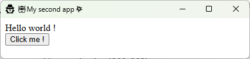
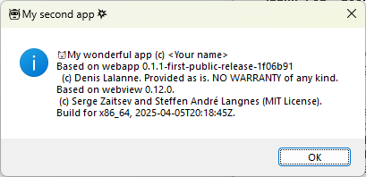

# Webapp Tutorial

*How to write your own standalone webapp
application in 2 steps*

## Introduction

The goal of the webapp tool is to allow creating application with web technology in the simplest possible way, assuming you already have some basic knowledge of creating web pages based on HTML, CSS and Javascript.
It is supposed to work in the same way, on both Windows and Linux, Operating Systems.
With this tutorial you will learn its general philosophy by creating simple applications.

## First step/First app: Hello World!

Our first application will be the everlasting "Hello World!" app.
   To achieve that just create a folder, let’s call it "first_app".
   And within this folder then create a file named "index.html" containing the sentence "Hello world!".
   Now to run the app, you just have to invoke the webapp binary with the folder you created.

You can achieve that in multiple ways:

1. By dropping the webapp binary in the folder and just clicking it.
2. Or by running at command line the webapp binary and providing it with the path of the folder as its only parameter, something like "/path/to/webapp path/to/first_app"
3. Or even by embedding the path webapp binary and your app’s folder in a desktop shortcut icon, but the creation of desktop shortcut is not the goal of this tutorial and it may vary depending on the Operating System you’re using.

For the sake of simplicity we will use the first way.

So when double-clicking on the webapp binary your application appears, like that:

<p align="center"><br/>Partial view of your First app</p>

Now if you want this application to have a persistent geometry, just add a file called ".config.ini" in its folder. And now when you will move or resize its window,  the last same size and position will be used each time the app will be invoked.

Note that you might get a somewhat similar result in a simpler way by just invoking the webapp binary and providing the html code as a parameter string, like the following:

```bash
webapp --html "Hello world!"`
```

Also try the following:

```bash
webapp  -d -s -t 'MsgBox' --html 'Hello world!<br/><button onclick=app.exit()>OK</button>' -j "app.set_size(210, 60, 3); app.center(); app.show()"
```

Or:

```bash
webapp  -t 'MsgBox' -c 'Hello world!<br/><button onclick=app.exit()>OK</button>' -G 100,100,200,100
```

However, using this html string option has limited possibilities.

## Second step/second app

Now for a somewhat more complex app, let create another folder, called "second_app" and within it, also create a file called "index.html" with the following content:

```html
<!DOCTYPE html>
<html>
<head>
    <meta charset="UTF-8">
    <meta http-equiv="Content-Type" content="text/plain; charset=utf-8">
    <title>🤖My second app💥</title>
    <link rel="icon" type="image/x-icon" href="app.ico">
    <style>
    </style>
    <script>
        const msg = "My wonderful app (c) <Your name>";
        console.log("Starting");
        if (app && typeof app !== "undefined" && typeof app.set_title === "function") {
            console.log("Starting as a webapp");
            app.show();
            app.set_title(document.title);
            app.set_icon("app.ico");
            //app.set_size(300,200);
            function clicked() {
                gui.msgbox("&#128570;" + msg + '\nBased on ' + app.info)
            }
        } else {
            console.log("Starting as a web page");
            function clicked() {
                alert("😺" + msg);
            }
        }
    </script>
</head>
<body>
    Hello world !
    <br />
    <button onclick="clicked()">Click me !</button>
</body>
</html>
```

You may also add a file .config.ini and an application icon.

And when running the webapp binary the following windows will appears:

<p align="center"><br/>Second app</p>

And if you click the "Click me!" button, the following dialog appears:

<p align="center"><br/>Native msgbox with your app</p>

Also notice that in the way this app has been created, it may also run correctly under a web browser.  See the below examples:

<p align="center"><br/>Second app under Chrome</p>
<p align="center"><br/>Second app under Firefox</p>

But it would not always be the case, notably when using the webapp "local objects", like app, fs, gui ... 

## Afterwards

To deepen your understanding of the webapp tool, you can test the different examples located in the "examples" directory.
